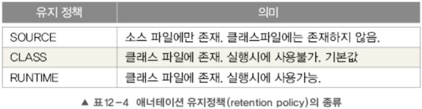

## 메타 애너테이션

> 애너테이션을 위한 애너테이션
>

즉 애너테이션에 붙이는 애너테이션으로 애너테이션을 정의할 때 애너테이션의 적용대상(target)이나 유지기간(reteation)등을 지정하는데 사용된다. `java.lang.annotation` 패키지에 포함되어 있다.

### @target

애너테이션이 적용 가능한 대상을 지정하는데 사용한다. 여러개의 값을 지정할 때는 배열에서처럼 괄호{}를 사용해야한다.


```java
import java.lang.annotation.Retention;
import java.lang.annotation.RetentionPolicy;

import static java.lang.annotation.ElementType.*;

@Target({TYPE, FIELD, METHOD, PARAMETER, CONSTRUCTOR, LOCAL_VARIABLE})
@Retention(RetentionPolicy.SOURCE)
public @interface SuppressWarnings {
    String[] value();
}
```

```java
@SuppressWarnings({"test"})
public class Test {
}
```
- @Target에서 Type을 지우면 에러가 난다.

### @retention

애노테이션이 유지(retention)되는 기간을 지정하는데 사용된다.

애너테이션은 사용 용도에 따라 @AnnotationName을 어느 범위까지 유지할 것인지 지정해야 한다. 이러한 유지정책은 `java.lang.annotation.RetentionPolicy`열거 상수로 아래와 같이 정의된다.



- RUNTIME 은 컴파일 이후에도 JVM 에 의해서 계속 참조가 가능합니다. 주로 리플렉션이나 로깅에 많이 사용된다.

- CLASS 은 컴파일러가 클래스를 참조할 때가지 유효하다.

- SOURCE 은 컴파일 전까지만 유효합니다. 즉, 컴파일 이후에는 사라지게 된다.

### **@documented**

`@Documented`는 애너테이션에 대한 정보가 javadoc으로 작성한 문서에 포함되도록한다. 자바에서 제공하는 기본 애너테이션 중애서 `@Override`와 `@SuppressWarnings`을 제외하면 모두 `@Documented`가 붙어 있다.

javadoc는 자바에서 지정한 형태의 주석들을 인식하여 html을 통해 api 문서 형태로 만들어주는 도구이다.


### @Inherited

애너테이션을 자손 클래스에 상속하고자 할 때, @Inherited를 붙인다.

```java
@Inherited
@interface CustomAnnotation{
}

@CustomAnnotation
class UpperClass {
}

// @CustomAnnotation 어노테이션을 붙이지 않아도 붙은 것으로 인식
class Cubclass extends UpperClass {
}
```

### @Repeatable

반복해서 붙일 수 있는 애너테이션을 정의할 때 사용

@Repeatable이 붙은 애너테이션은 반복해서 붙일 수 있다.

```java
@Repeatable(CustomAnnotation.class)
@interface CustomAnnotation {
    String value();
}
```

```java
@CustomAnnotation("Hello")
@CustomAnnotation("Java")
@CustomAnnotation("World")
class Test {
}
```

### @Native

Native method에 의해 참조되는 ‘상수 필드'에 붙이는 애너테이션이다.
native는 자바가 아닌 언어(보통 C나 C++)로 구현한 후 자바에서 사용하려고 할 때 이용하는 키워드이다.
자바로 구현하기 까다로운 것을 다른 언어로 구현해서, 자바에서 사용하기 위한 방법이다. 구현할때 JNI(Java Native Interface)를 사용한다


## **애노테이션 타입 정의하기**

‘@’기호를 붙이는 것을 제외하면 인터페이스를 정의하는 것과 동일

```java
@interface 애노테이션이름 {
    타입 요소이름();  // 애노테이션의 요소를 선언.
      ...
}
```

### 애너테이션의 요소

애너테이션 내에 선언된 메서드를 애너테이션의 요소라고 한다. 애노테이션에도 인터페이스 처럼 상수를 정의할 수 있지만, 디폴트 메서드를 정의 할 수 없다.

- 요소의 타입은 기본형, String, enum, 애노테이션, Class만 허용된다.
- ( )안에 매개변수를 선언할 수 **없다.**
- 예외를 선언할 수 없다.
- 요소를 타입 매개변수로 정의할 수 없다.

애노테이션의 요소는 반환값이 있고 매개변수는 없는 추상 메서드의 형태를 가지며, 상속을 통해 구현하지 않아도 된다.

```java
public @interface AnnoEx_01 {
    int num();
    String str();
    String[] strArr();
}
```

애노테이션의 각 요소는 기본값을 가질 수 있으며, 기본값이 있는 요소는 애노테이션을 적용할 때 값을 지정하지 않으면 기본값이 사용된다. 이 때 기본값으로 null을 제외한 모든 리터럴이 사용된다.

```java
@interface TestAnno {
    int count() default 1;
}

@TestAnno   // @TestAnno(count = 1)과 동일
public class NewClass { ... }
```

애노테이션 요소가 하나뿐이고 이름이 value인 경우, 애노테이션을 적용할 때 요소의 이름을 생략하고 값만 적어도 된다.

```java
@interface TestAnno {
    String value();
}

@TestAnno("java") // @TestAnno(value = "java")
class NewClass { ... }
```

요소의 타입이 배열인 경우, 괄호 { }를 사용해서 여러 개의 값을 지정할 수 있다. 기본값을 지정할 때도 괄호 { }를 사용할 수 있다.

```java1
@interface TestAnno {
    String[] strArr();
}

@Test(strArr = {"One", "Two"})  // 값이 여러 개인 경우
@Test(strArr = "Three")         // 값이 하나일 때는 괄호 생략 가능
@Test(strArr = {})              // 값이 없을 때는 생략 불가능
```

```java
@interface TestAnno {
    String[] strArr_1() default {"A is a", "B is b"};   // 기본 값이 여러 개인 경우
    String[] strArr_2() default "C is c";               // 기본 값이 하나인 경우
}

@TestAnno
class NewClass { ... }
```

## 마커 애노테이션 Marker Annotation

값을 지정할 필요가 없는 경우, 애노테이션의 요소를 하나도 정의하지 않을 수 있다. 이렇게 요소가 하나도 정의되지 않은 애노테이션을 마커 애노테이션이라고 한다.

```java
@Target(ElementType.METHOD)
@Retention(RetentionPolicy.SOURCE)
public @interface Test { }    // 마커 애노테이션. 정의된 요소가 하나도 없다.
```
