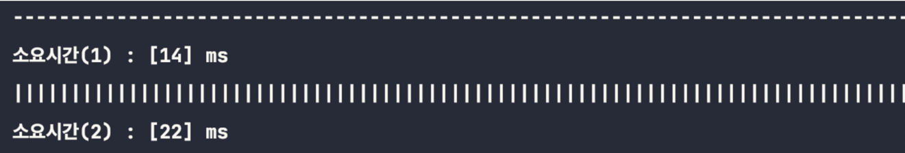

## 프로세스와 쓰레드 (Process vs Thread)

### 프로세스(Process)

* 일반적으로는 cpu에 의해 메모리에 올려져 실행중인 프로그램을 말한다.
* 자신만의 메모리 공간을 포함한 독립적인 실행 환경을 갖고 있다.
* 자바 JVM도 하나의 프로세스라고 볼 수 있다.

### 쓰레드(Thread)

* 프로세스 안에느 실질적으로 작업을 실행하는 단위를 의미한다.
* 자바에서는 JVM에 의해 관리된다.
* 프로세스는 적어도 한 개 이상의 쓰레드가 있다.
* Java 실행시 Main 쓰레드 하나로 시작하여 쓰레드를 추가 생성하게 되면 멀티 쓰레드 환경이 된다.
* 쓰레드들은 프로세스의 리소스를 공유하기 때문에 효율적이긴 하지만 잠재적인 문제점에 노출 될 수 있다.

> 프로세스가 가질 수 있는 쓰레드의 갯수는 제한이 있을까?
> > 제한 되어 있지 않다 ! <br>
> 다만, 쓰레드는 작업을 수행하는 메모리 공간이 필요하다. <br>
> 따라서 프로세스가 할당받은 메모리 한계에 따른 개수 제한이 있다고 불 수 있다. <br>
> (실제로는 메모리 한계점에 다다를 정도로 많은 쓰레드를 생성할 일이 없음.)

## 멀티 프로세스(멀티태스킹, 다중작업) vs 멀티쓰레드

### 멀티태스킹

* 동시에 여러 프로세스를 실행시키는 것
* ex) 게임하면서 음악듣기

### 멀티쓰레딩

* 하나의 프로세스 내에 동시에 여러 쓰레드를 실행시키는 것

> **멀티 쓰레드 장점**
> * CPU의 사용률을 향상시킨다.
> * 자원을 효율적으로 사용할 수 있다.
> * 사용자에 대한 응답성이 향상된다.
> * 작업이 분리되어 코드가 간결해진다.
>
>
> **멀티 쓰레드 단점**
> * 동기화(synchronization)
> * 교착상태(deadlock) : 두 쓰레드가 자원을 점유한 상태에서 서로 상대펀이 점유한 자원을 사용하려고 기다리느라 진행이 멈춰있는 상태

## 쓰레드의 구현과 실행

1. Thread 클래스 상속

 ```java
// Thread 클래스 상속
class ThreadClass extends Thread {
    // Thread 클래스의 run() 을 오버라이딩
    public void run() {
        // 로직 구현
    }
}
 ```

2. Runnable 인터페이스 구현

 ```java
// Runnable 인터페이스 구현
class RunnableClass implements Runnable {
    // Runnable 인터페이스의 추상메서드 run() 을 구현
    public void run() {
	    ...
    }
}
 ```

* 클래스는 상속받으면 다른 클래스를 상속받을 수 없기 때문에, 인터페이스인 Runnable로 구현하는 방법이 일반적이다.

* 또한 재사용성(reusability)이 높고 코드의 일관성(consistency)을 유지할 수 있기 때문에 보다 객체지향적인 방법이다.

```java
class ThreadEx1 {
    public static void main(String args[]) {
        ThreadEx1_1 t1 = new ThreadEx1_1();

        Runnable r = new ThreadEx1_2();
        Thread t2 = new Thread(r);      // 생성자 Thread(Runnable target)

        t1.start();
        t2.start();
    }
}

class ThreadEx1_1 extends Thread {
    public void run() {
        for (int i = 0; i < 5; i++) {
            System.out.println(getName()); // 조상인 Thread의 getName()을 호출
        }
    }
}

class ThreadEx1_2 implements Runnable {
    public void run() {
        for (int i = 0; i < 5; i++) {
            System.out.println(Thread.currentThread().getName());
        }
    }
}
```

### 쓰레드의 실행 - start()

* 쓰레드를 생성했다고 해서 자동으로 실행되는 것은 아니다.
* start()를 호출해야 쓰레드가 실행대기 상태로 전환되고, 자신의 차례가 되어야 실행된다.
* 쓰레드는 한번 실행이 종료되면 다시 실행될 수 없다.
* 즉, 하나의 쓰레드에 대하여 두번의 start()는 호출될 수 없다.

```java
public class Main {
    static class exam implements Runnable {

        @Override
        public void run() {
            System.out.println("start");
        }
    }

    public static void main(String[] args) {
        Thread thread = new Thread(new MyRunnableImpl());
        thread.start();
        thread.start();
        // IllegalThreadState 예외 발생
    }
}
```

## start()와 run()

- Runnable 혹은 Thread를 상속받아 구현한 메서드가 run() 이다. <br> 그러나 쓰레드를 실행시킬 때에는 start()를 사용하여 실행했다. 왜 ??

```java
public class Main {
    static class exam implements Runnable {

        @Override
        public void run() {
            System.out.println(Thread.currentThread().getName() + "  Start!!");
        }
    }

    public static void main(String[] args) {
        Thread thread = new Thread(new MyRunnableImpl());
        thread.run();
        thread.start();

        // 실행 결과
        // Main Start!!
        // Thread-0 Start !! 
    }
}
```

* 즉 run으로 실행시 메인쓰레드에서 단순히 메서드가 실행되는 것
* start로 실행시 새로운 Call stack에서 run메서드가 실행되는 것

* 기본적으로 Call Stack의 최상위 메서드를 제외한 메서드는 대기상태에 존재하고, 최상위 메서드만이 실행 중인 메서드가 된다. <br>
  그러나 위와 같이 쓰레드가 둘 이상인 경우에는 Call Stack의 최상위 메서드라고 하더라도 대기상태에 있을 수 있다. <br>
  OS 스케줄러는 실행대기 상태의 쓰레드들의 우선순위를 고려하여 실행순서와 실행시간을 결정하고, <br>
  각 쓰레드들을 스케줄에 따라서 자신의 순서가 되면, 자신에게 할당된 시간만큼 작업을 수행한다. <br>


* 만약 주어진 시간동안 작업을 마치지 못했다면, 다시 다신의 차례가 돌아올 때까지 실행대기 상태로 대기하고 <br>
  작업을 마친 쓰레드의 경우에는 해당 쓰레드에 대한 Call Stack이 모두 비워지므로 해당 쓰레드가 사용하던 Call Stack은 제거된다.

### Main 쓰레드

* main 메서드의 작업을 실행하는 쓰레드를 main thread라고 한다.
* 프로그램을 실행하게 되면 기본적으로 하나의 쓰레드가 생성되고, <br>
  해당 쓰레드가 main 메서드를 호출하여 작업이 수행되도록 하는 것이다.
* 실행중인 사용자 쓰레드가 없을 때 프로그램은 종료된다.

## 싱글쓰레드와 멀티쓰레드

1. 싱글쓰레드

```java
public class Example {
    public static void main(String[] args) {
        long start = System.currentTimeMillis();

        for (int i = 0; i < 3000; i++) {
            System.out.printf("%s", new String("-"));
        }
        System.out.println();
        System.out.println("소요시간(1) : [" + (System.currentTimeMillis() - start) + "] ms ");

        for (int i = 0; i < 3000; i++) {
            System.out.printf("%s", new String("|"));
        }
        System.out.println();
        System.out.println("소요시간(2) : [" + (System.currentTimeMillis() - start) + "] ms ");
    }
}
```



2. 멀티쓰레드

```java
public class Example {
    static long start;

    static class MyRunnable implements Runnable {

        @Override
        public void run() {
            for (int i = 0; i < 3000; i++) {
                System.out.printf("%s", new String("-"));
            }
            System.out.println();
            System.out.println("소요시간(1) : [" + (System.currentTimeMillis() - start) + "] ms ");
        }
    }


    public static void main(String[] args) {
        Thread thread = new Thread(new MyRunnable());
        start = System.currentTimeMillis();

        thread.start();
        for (int i = 0; i < 3000; i++) {
            System.out.printf("%s", new String("|"));
        }
        System.out.println();
        System.out.println("소요시간(2) : [" + (System.currentTimeMillis() - start) + "] ms ");

    }

    // 소요시간(1) : [25] ms
    // 소요시간(2) : [23] ms
}
```


### 왜 멀티쓰레드가 더 느릴까?

1. 하나는 두 쓰레드가 번갈아가면서 작업을 처리하기에 Context Switching이 발생
2. 다른 하나는 한 쓰레드가 화면(console)에 출력하는 동안 다른 쓰레드는 출력이 끝나기를 기다려야 하는데, 이때 발생하는 대기시간 때문이다. <br>
   즉 공통된 화면(console)이라는 자원에 대한 Race Condition이 발생하기 때문입니다.

#### Race Condition ?

> 두 개 이상의 프로세스(혹은 스레드)가 하나의 자원(리소스)에 접근하기 위해 경쟁하는 상태를 말합니다. <br>
> 참고로 여러 쓰레드가 여러 작업을 동시에 진행하는 것을 병행(동시)(concurrent)이라 하고,<br>
> 하나의 작업을 여러 쓰레드가 나눠서 처리하는 것을 병렬(parallel)이라 합니다.


> 그러나 두 쓰레드가 **서로 다른 자원**을 사용하는 경우는 멀티쓰레드가 효율적이다. !

 ```java
public static void main(String[] args) {
        Scanner sc = new Scanner(System.in);
        String s = sc.nextLine();
        System.out.println(s);

        for (int i = 0; i < 10; i++) {
          try {
             Thread.sleep(1000);
          } catch (InterruptedException e) {
             e.printStackTrace();
          }

          System.out.printf("%s", "|");
        }
}
```

 ```java
public class Main {
    static class MyRunnable implements Runnable {

        @Override
        public void run() {
            Scanner sc = new Scanner(System.in);
            String s = sc.nextLine();
            System.out.println(s);
        }
    }

    public static void main(String[] args) {
        Thread thread = new Thread(new MyRunnable());
        thread.start();

        for (int i = 0; i < 10; i++) {
            try {
                Thread.sleep(1000);
            } catch (InterruptedException e) {
                e.printStackTrace();
            }
            System.out.printf("%s", new String("|"));
        }
    }
}
```