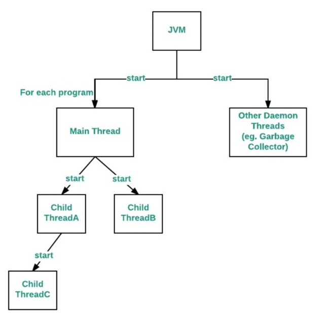
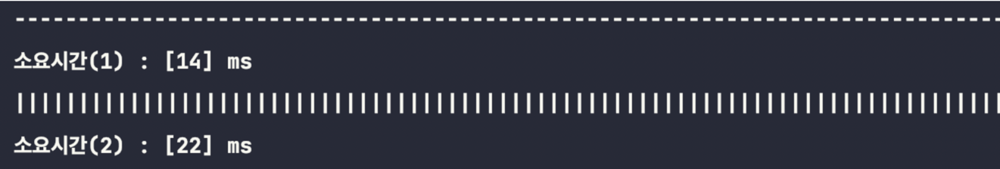

## 쓰레드의 우선순위

- 작업의 중요도에 따라 쓰레드의 우선순위 다르게 지정하여 특정 쓰레드가 더 많은 작업시간을 갖도록 할 수 있다.
-  우선순위는 1 ~ 10 까지 지정 가능
-  숫자가 높을수록 우선순위 ↑
- 쓰레드의 우선순위는 쓰레드를 생성한 쓰레드로부터 상속받는다.
- main메서드를 수행하는 쓰레드는 우선순위가 5이므로 main메서드 내에서 생성하는 쓰레드의 우선순위는 default 5

```java
public static void main(String[] args) {
    Thread thread1 = new Thread(() -> {
        for(int i = 0; i< 5; i++) System.out.println("thread1 is running...");
        System.out.println();
    });

    Thread thread2 = new Thread(() -> {
        for(int i = 0; i< 5; i++) System.out.println("thread2 is running...");
        System.out.println();
    });

    thread1.setPriority(5);
    thread2.setPriority(10);

    thread1.start();
    thread2.start();
}
```

** **
- 우선순위가 높다고 항상 먼저 수행되는 것은 아니다.
- 우선순위는 코드가 수행되는 순서를 정해주는 것이 아닌, 해당 스레드가 수행될 빈도수를 높여주는 것으로 이해하는 게 좀 더 맞을 것 같다.

```java
    thread1.setPriority(5);
    thread2.setPriority(6);
```



**## 쓰레드 그룹(thread group)**
: 서로 **관련된 쓰레드**를 그룹으로 다루기 위한 것
- 보안상의 이유로 도입
- 모든 쓰레드는 반드시 하나의 쓰레드 그룹에 포함
- 쓰레드 그룹을 지정하지 않고 생한한 쓰레드는 main쓰레드 그룹에 속함

```java
    public static void main(String[] args) {
        Thread thread = new Thread();
        System.out.println(thread.getThreadGroup().getName());
        // 결과 : main
    }
```

> ### 자바 어플리케이션이 실행되면
> 1. 실행
> 2. JVM이 `main`과 `system` 이름을 가진 쓰레드 그룹 생성
> 3. JVM운영에 필요한 쓰레드들을 생성
> 4. 각자 해당하는 쓰레드 그룹에 포함시킴
> - ex) main쓰레드 - main쓰레드 그룹 / (가비지컬렉션을 수행하는)Finalizer쓰레드 - system쓰레드 그룹

- 자바 실행시 구동되는 스레드들의 정보
```java
public static void main(String[] args) {
        Set<Thread> threads = Thread.getAllStackTraces().keySet();
        for (Thread thread : threads) {
        System.out.println(thread.getThreadGroup().getName() + " --- " + thread.getName());
        }

        /** 
         * system --- Reference Handler
         * InnocuousThreadGroup --- Common-Cleaner
         * main --- main
         * system --- Attach Listener
         * main --- Monitor Ctrl-Break
         * system --- Signal Dispatcher
         * system --- Finalizer
         */
        }
```

- 자신을 생성한 쓰레드의 그룹과 우선순위를 상속 받음.
- 자신이 속한 쓰레드 그룹 or 하위 쓰레드 그룹은 변경가능하지만 다른 쓰레드 그룹의 쓰레드는 변경 불가
- ThreadGroup의 생성자와 메서드

- Thread 생성자를 이용해 쓰레드 그룹에 포함 시킬 수 있다.


```java
public static void main(String[] args) {
    ThreadGroup threadGroup = new ThreadGroup("create thread group");
    Thread thread = new Thread(threadGroup, "신규 쓰레드");

    System.out.println("그룹 이름 : " + thread.getThreadGroup().getName());
    System.out.println("쓰레드 이름 : " + thread.getName());

    //그룹 이름 : create thread group
    //쓰레드 이름 : 신규 쓰레드
}
```
## 데몬 쓰레드(daemon thread)
: 다른 일반 쓰레드(데몬 쓰레드가 아닌 쓰레드）의 작업을 돕는 보조적 인 역할을 수행하는쓰레드
- 일반 쓰레드가 모두 종료되면 자동 종료
- 무한루프와 조건문을 이용해 실행 후 대기하다 특정 조건시 수행하고 다시 대기하도록 작성
- ex) 가비지 컬렉터, 자동저장, 화면자동갱신
