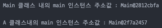

# 변수와 메서드

## 클래스 변수, 인스턴스 변수, 지역변수

| 변수의 종류 | 선언위치 | 생성시기 |
| --- | --- | --- |
| 클래스 변수 | 클래스 영역 | 클래스가 메모리에 올라갈 때 |
| 인스턴스 변수 | 클래스 영역 | 인스턴스가 생성되었을 때 |
| 지역변수 | 클래스 영역 이외의 영역(메서드, 생성자, 초기화 블럭 내부) | 변수 선언문이 수행되었을 때 |

```java
public class Main {
    public static int classVariable; // 클래스 변수
    public int instanceVariable; // 인스턴스 변수

    public static void main(String[] args) throws IOException {

        Main main = new Main();
        System.out.println("before classVariable :" + classVariable);
        System.out.println("before instanceVariable :" + main.instanceVariable + "\n");

        A a = new A();
        a.valueIncrease();

        System.out.println("after classVariable :" + classVariable);
        System.out.println("after instanceVariable :" + main.instanceVariable);
    }
}
```

```java
class A {
    public void valueIncrease() {
        int localVariable = 0; // 지역변수
        Main main = new Main();
        Main.classVariable++;
        main.instanceVariable++;
        System.out.println("A class의 메서드에서 Main의 클래스 변수 및 인스턴스 변수 값 증가..." + "\n");
    }
}
```

> 실행 결과

> 

### 클래스 변수(static 변수)

- 변수값을 모든 인스턴스가 공유
- 보통 상수로 많이 사용함
    - ex) Integer 클래스의 MAX_VALUE
  ``` java
  public static final int MAX_VALUE = 0x7fffffff;
   ```
- JVM 실행시 Method Area에 생성됨

### 인스턴스 변수

- 클래스의 영역에 선언되며, 인스턴스를 생성할 때 만들어짐
- 인스턴스 변수를 읽거나 저장하려면 먼저 인스턴스를 생성해야 함
- 인스턴스마다 별도의 저장공간을 가지므로 서로 다른 값을 가질 수 있음
  > 
- 인스턴스가 생성될 때 Head 영역에 생성되고, Gc가 메모리를 수거할 때 소멸됨

### 지역변수

```java
class A {
    public void method() {
        int localVariable;
    }
}
```

- localVariable 변수로 접근 자체가 불가능함
- A클래스의 인스턴스를 생성하고 메서드를 통한 접근도 불가능
- 지역변수는 생성시 public 선언이 제한됨
- 메서드 실행될때 생성되고 종료시 소멸(Stack 영역)

## 메서드

- 특정 작업을 수행하는 일련의 문장들을 하나로 묶은 것

### 메서드를 사용하는 이유

1. 높은 재사용성
2. 중복코드 제거
3. 프로그램의 구조화

### 메서드의 선언과 구현

```java
public class A {
    public int add(int a, int b) { // 선언부음
    }
}
```

- 선언부의 메서드 이름, 매개변수, 반환타입은 신중히 작성
- 메서드의 return 값이 없을경우 타입을 void로 지정

### 메서드의 호출

```java
public class Main {
    A a = new A();
    System.out.println(a.add(1,2));
}

```

- 인스턴스 생성 후 인스턴스 내부의 메서드 호출
- 만약 static 메서드이면 인스턴스를 생성할 필요 없음

```java
public class Main {
    public static void main(String[] args) {
        A.method();
    }
}

class A {
    public static void method() {
        System.out.println("method call");
    }
}
```

### 매개변수의 유효성 검사
```java
float divide(int x, int y) {
    //작업을 하기 전에 나누는 수(y)가 0인지 확인한다
    if (y == 0) {
        System.out.println("0으로 나눌 수 없습니다");
        return 0;
    }
    return (float) x / (float) y;
}
```

 - 적절하지 않은 값이 매개변수를 통해 넘어온다면 매개변수의 값을 보정하던가, 
  보정하는 것이 불가능하다면 return문을 사용해서 작업을 중단하고 호출한 메서드로 되돌아가야한다.
 - 또한 심각한 문제를 유발할 수 있는 코드인경우는 예외를 발생시켜줘야한다.

